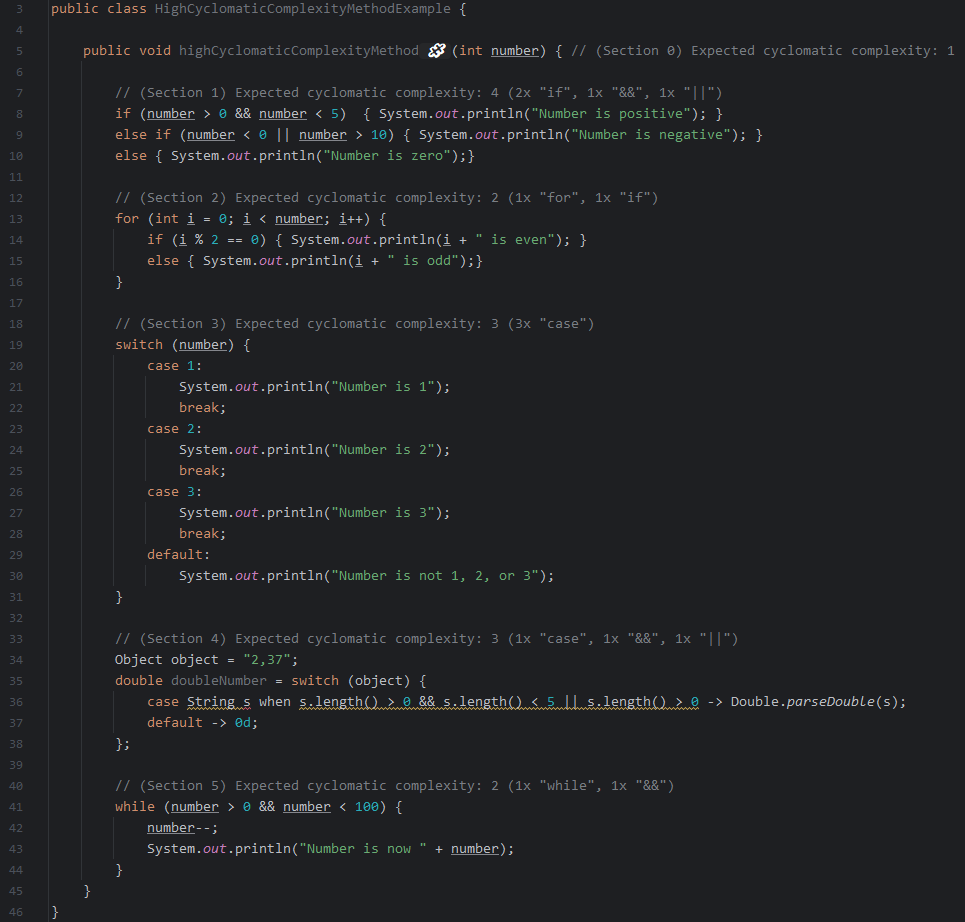
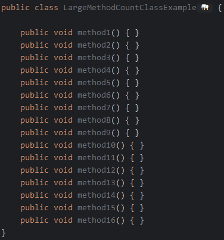
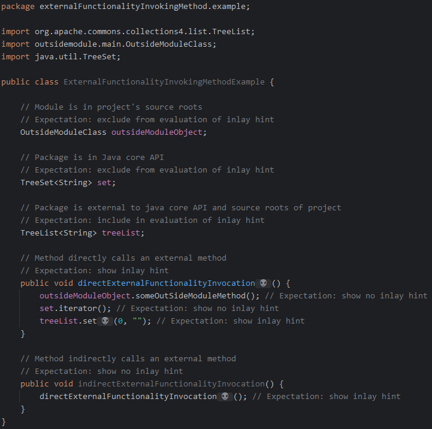
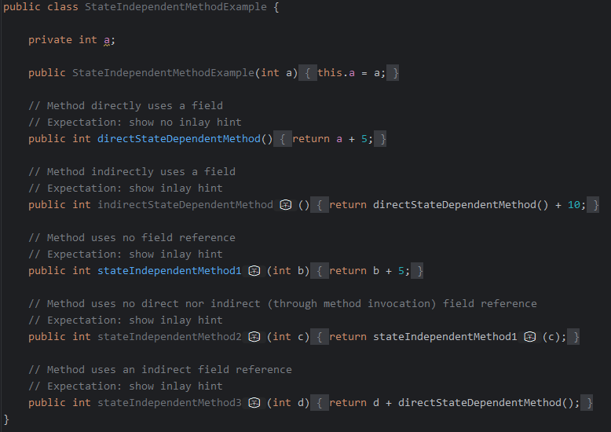

<!-- DESCRIPTION HEADER BEGIN -->

**codeEEmoji** is a plugin made for Intellij Idea and useful for Java programming. The plugin defines new sets of inlay
hints in the context of code
augmentation. The new inlay hints use emojis in an innovative way to help the developer. Emojis are displayed for
anti-pattern cases such as naming
violations or bad programming practices. The plugin can also show emojis in the editor indicating the presence of
modifiers for classes, fields,
methods, parameters or local variables that are being used. Likewise, the developer can indicate emojis to display for
all these elements, according
to a rule, for example, for a class being instantiated that implements a specific interface, for a method being invoked
that is annotated by a certain
annotation , a local variable of a given type, and so on. Furthermore, the plugin has the capability to display implicit
annotations for the JakartaEE and Spring frameworks.

<!-- DESCRIPTION HEADER END -->

https://github.com/codeemoji/codeemoji-plugin/assets/7922567/b551c5e5-9b9a-490c-9538-c0cf818b49ee

<!-- TOC -->

* [Setup and Use](#setup-and-use)
    * [Prerequisites](#prerequisites)
    * [How to Install](#how-to-install)
        * [Via marketplace](#via-marketplace)
        * [Manual Installation](#manual-installation)
    * [How to Configure](#how-to-configure)
* [Cases of Naming Violation](#cases-of-naming-violation)
    * [Short Descriptive Name](#short-descriptive-name)
    * [Getter More Than Accessor](#getter-more-than-accessor)
    * [_Is_ Returns More Than a Boolean](#_is_-returns-more-than-a-boolean)
    * [Setter Method Returns](#setter-method-returns)
    * [Expecting But Not Getting a Single Instance](#expecting-but-not-getting-a-single-instance)
    * [Validation Method Does Not Confirm](#validation-method-does-not-confirm)
    * [Getter Does Not Return](#getter-does-not-return)
    * [Not Answered Question](#not-answered-question)
    * [Transform Method Does Not Return](#transform-method-does-not-return)
    * [Expecting But Not Getting a Collection](#expecting-but-not-getting-a-collection)
    * [Says One But Contains Many](#says-one-but-contains-many)
    * [Name Suggests Boolean By Type Does Not](#name-suggests-boolean-by-type-does-not)
    * [Says Many But Contains One](#says-many-but-contains-one)
    * [Name Contains Only Special Characters](#name-contains-only-special-characters)
* [Cases of Showing Modifiers](#cases-of-showing-modifiers)
* [Cases of Showing Specifics of Projects](#cases-of-showing-specifics-of-projects)
* [Cases of Showing Implicit Annotations](#cases-of-showing-implicit-annotations)
* [Cases of Structural Analysis](#cases-of-structural-analysis)
    * [Code Complexity](#code-complexity)
        * [High Cyclomatic Complexity Method](#high-cyclomatic-complexity-method)
        * [Large Identifier Count Method](#large-identifier-count-method)
        * [Large Line Count Method](#large-line-count-method)
        * [Large Method Count Class](#large-method-count-class)
    * [Methods](#methods)
        * [External Functionality Invoking Method](#external-functionality-invoking-method)
        * [Pure Getter Method](#pure-getter-method)
        * [Pure Setter Method](#pure-setter-method)
        * [State Changing Method](#state-changing-method)
        * [State Independent Method](#state-independent-method)
* [External Services API](#external-services-api)
* [How to Extend](#how-to-extend)
    * [Providers](#providers)
    * [Collectors](#collectors)
        * [CESimpleCollector](#cesimplecollector)
            * [External Analyzers](#external-analyzers)
        * [CEProjectCollector](#ceprojectcollector)
        * [CEImplictCollector](#ceimplictcollector)
    * [Internationalization](#internationalization)
* [Acknowledgements](#acknowledgements)
* [References](#references)

<!-- TOC -->

# Setup and Use

## Prerequisites

- [**IntelliJ IDEA 2023.***](https://www.jetbrains.com/idea/download/other.html) (Ultimate, Community or Educational)
- JDK 17 [(*Eclipse Temurin - as a suggestion*)](https://github.com/adoptium/temurin17-binaries/releases)

## How to Install

### Via marketplace

[JetBrains Marketplace - **codEEmoji**](https://plugins.jetbrains.com/plugin/22416-cod-emoji)


### Manual Installation

- Download the latest release zip file available
  from [Releases](https://github.com/codeemoji/codeemoji-plugin/releases).


- Open Intellij IDEA and navigate to **_"File>Settings>Plugins"_** menu. Click on the gear icon and the "*
  *_Install Plugin From Disk..._**" option.
  Select the downloaded zip file and click "**_OK_**".


- Restart IDE.

## How to Configure

The plugin creates new Inlay hints. All new inlay hints are enabled by default when installing the plugin. To disable
inlay hints or configure
options that are available for each one, go to "**_File>Settings>Editor>Inlay Hints_**". Click "**_Other>Java_**".


# Cases of Naming Violation

## Short Descriptive Name

Instead of a descriptive name, the variable's name consists of a few letters.

**Configuration options:** Number of letters

_**Impacted identifiers: Fields, Method Parameters and Local Variables**_


## Getter More Than Accessor

A getter that doesn't just return the corresponding attribute but also takes other actions. Adapted from Arnaoudova et
al.(2016).

_**Impacted identifiers: Method Names**_


## _Is_ Returns More Than a Boolean

A method's name is a predicate that denotes a true/false value that will be returned. The return type, however, is a
more complex type than boolean.
Adapted from Arnaoudova et al.(2016).

_**Impacted identifiers: Method Names**_


## Setter Method Returns

A setter method that has a return type other than void. Adapted from Arnaoudova et al.(2016).

_**Impacted identifiers: Method Names**_


## Expecting But Not Getting a Single Instance

Despite the fact that a method's name suggests it will return a single object, it will actually return a collection.
Adapted from Arnaoudova et al.(
2016).

_**Impacted identifiers: Method Names**_


## Validation Method Does Not Confirm

A validation method (such as one with the words <em>validate,</em> <em>check,</em> or <em>ensure</em>) does not confirm
the validation; that is, it
neither provides a return value indicating whether the validation was successful. Adapted from Arnaoudova et al.(2016).

_**Impacted identifiers: Method Names**_


## Getter Does Not Return

When a method's name begins with <em>get</em> or <em>return</em>, for example, it might be assumed that it returns
something, but the return type is
actually void. Adapted from Arnaoudova et al.(2016).

_**Impacted identifiers: Method Names**_


## Not Answered Question

A method's name takes the form of a predicate, but its return type is not boolean. Adapted from Arnaoudova et al.(2016).

_**Impacted identifiers: Method Names**_


## Transform Method Does Not Return

While there is no return value, a method's name implies that an object has been transformed. Adapted from Arnaoudova et
al.(2016).

_**Impacted identifiers: Method Names**_


## Expecting But Not Getting a Collection

Even though a method's name suggests a collection should be returned, nothing or just one object is instead given.
Adapted from Arnaoudova et al.(
2016).

_**Impacted identifiers: Method Names**_


## Says One But Contains Many

An attribute's type suggests that it stores a collection of objects, contrary to the name, which suggests a single
instance. Adapted from Peruma et
al.(2021).

_**Impacted identifiers: Fields, Method Parameters and Local Variables**_


## Name Suggests Boolean By Type Does Not

An attribute's name implies that its value is true or false, yet its defining type is not boolean. Adapted from
Arnaoudova et al.(2016).

_**Impacted identifiers: Fields, Method Parameters and Local Variables**_


## Says Many But Contains One

The name of an attribute suggests multiple instances, but its type suggests a single one. Adapted from Arnaoudova et
al.(2016).

_**Impacted identifiers: Fields, Method Parameters and Local Variables**_


## Name Contains Only Special Characters

The identifier's name is made up entirely of non-alphanumeric characters. Adapted from Arnaoudova et al.(2016).

_**Impacted identifiers: Fields, Method Parameters and Local Variables**_


# Cases of Showing Modifiers

This inlay hint allows you to configure the display of emojis for class, field and method modifiers. Emojis are
displayed when an element is used in the code, indicating its modifiers. The figure below shows the configuration screen
with the options enabled during installation. Then a code snippet is displayed, where all options have been enabled.

_**Impacted identifiers: Classes, Fields and Methods**_


# Cases of Showing Specifics of Projects

This inlay hint is displayed according to the specifics of the project. It must be configured by the developer from a
file in the root of the
project named *"codeemoji.json"*. It allows indicating rules for displaying emojis according to specific features for
each element, as follows:

- Element: Class
    - Features: Annotations, Extends and Implements
- Element: Field
    - Features: Annotations, Types
- Element: Method
    - Features: Annotations, Returns, Packages
- Element: Parameter
    - Features: Annotations, Types
- Element: Local Variable
    - Features: Annotations, Types

For each element, it is possible to optionally indicate an emoji from
the [unicode sequence](https://unicode.org/Public/emoji/15.0/emoji-sequences.txt) that represents it. The *"
codeemoji.json"* file follows
a simple description pattern, as shown in the following a partial example:


Complete example [here](docs/samples/codeemoji.json).

In the configuration screen of this inlay hint, the rules currently defined for the open project are displayed. See the
following figure.


Here's an example of usage from a code snipped:


# Cases of Showing Implicit Annotations

Unlike other cases, this inlay hint is useful for displaying implicit annotations when frameworks are used. It can be
displayed for an entirely implicit annotation, for implicit annotation parameters, or even for implicit values for
annotation parameters.

Implicit information is understood to be information that is optional, but with a different standard value. For example,
a class mapped with _@Entity_ will have _@Column_ implicit for almost all fields (restrictions apply), where the _name_
parameter of the
annotation will have the name of the field as its value.

So far the plugin implements some _JPA_ mapping annotations (_Java Persistence API_ - _javax_ and _jakarta_ packages),
and some useful _Spring_ framework annotations.

In the configuration screen of this inlay hint, the annotations currently implemented by plugin are displayed.
See the following figure.


Here's an example of usage with _JPA_ from a code snipped:


Here's an examples of usage with _Spring_ from a code snipped:


# Cases of Structural Analysis

The plugin also incorporates implementations of inlay hints that are used to display structural characteristics of
syntactic elements in order to deduce implicit information contained in them. The visual aid provided
by such hints can facilitate the creation of complex code where the programmer is required to contextualize
otherwise difficultly inferable knowledge. A subset of these implementations specifically concerns the calculation of
code complexity metrics that help determining the difficulty level in understanding and maintaining code.

## Code Complexity

The computed code complexity metrics encompass the total number of methods per class, the cyclomatic complexity per
number of lines of code in a method, the total number of identifiers per method and the total number of lines per
method. Each one of them has a predetermined but configurable threshold which, if exceeded, triggers the addition of
an inlay hint displaying a warning.

### High Cyclomatic Complexity Method

A code complexity metric that, based on a configurable threshold, indicates whether a method has a "very high" number of
linearly independent paths with respect to the number of lines in it.

The algorithm for calculating the metric is adapted from the specification defined by
Watson and McCabe ("Structured Testing: A Testing Methodology Using the Cyclomatic Complexity Metric", 1996).
Starting from a value _S := 1_, the code elements present in the method are analyzed to match keywords that create a
decision point, therefore, triggering the addition of a new path, which, in turn, entails increasing _S_ by a factor of
1.
The keywords and operators considered in such analysis do not allow the inspection single multi-way branch statements
(eg. if a switch statement is recognized, only add 1 to S for each case label); they are the following:

- "&&" and "||"
- "if" and "else if"
- "case"
- "for" and "while"
- "try"

The default value for this metric is set to  _0.36 Cyclomatic Complexity / Lines of Code_, which corresponds to the
statistical threshold cited by Lanza and Marinescu ("Object-Oriented Metrics in Practice", 2006).

Notice that the calculation is triggered once the method exceeds the thresholds for the cyclomatic complexity and the
line count, which are both set to 1 by default. The line count does not include any superfluous lines
covered by comments.

<table>
<thead>
  <tr>
    <th colspan="2">Inlay hint information</th>
  </tr>
</thead>
<tbody>
  <tr>
    <td><b>Emoji</b></td>
    <td>🧩</td>
  </tr>
  <tr>
    <td><b>Impacted identifiers</b></td>
    <td>Method names</td>
  </tr>
</tbody>
</table>

| **_Configuration_**                                                                                                                                                             |
|:--------------------------------------------------------------------------------------------------------------------------------------------------------------------------------|
|                                                                        |
|                                                                       |
|                                                                       |
| *Set custom thresholds by opening the settings/preferences and navigating to: **Editor &rarr; Inlay Hints &rarr; Other &rarr; Java &rarr; High Cyclomatic Complexity Method**.* |

| **_Example_**                                                                                                                                                                                                                                                                                                                                                                                                                                                                                                    |
|:-----------------------------------------------------------------------------------------------------------------------------------------------------------------------------------------------------------------------------------------------------------------------------------------------------------------------------------------------------------------------------------------------------------------------------------------------------------------------------------------------------------------|
|                                                                                                                                                                                                                                                                                                                                                                                                         |
| *The method shown above has a **cyclomatic complexity of 15**. Such number is obtained by summing the amount of the matching keywords and operations from sections 0 trough 5. The method also spans over **34 lines of code (excluding those covered by comments)**, from line 6 to line 44. The rounded ratio between these two numbers equals to **0.44 cyclomatic complexity / lines of code**. The plugin displays the inlay hint if the threshold is set to a value smaller than or equal to such amount.* |

### Large Identifier Count Method

A code complexity metric that indicates whether a method contains a "very high" number of identifiers based on a
configurable threshold.

An identifier indicates a lexical token that associates a symbolic name to a Java syntax entity. For instance, some of
the entities an identifier might denote include: variables, data types, classes or methods.

The default value is set to <em>70 Identifiers / Method</em>.

<table>
<thead>
  <tr>
    <th colspan="2">Inlay hint information</th>
  </tr>
</thead>
<tbody>
  <tr>
    <td><b>Emoji</b></td>
    <td>📚</td>
  </tr>
  <tr>
    <td><b>Impacted identifiers</b></td>
    <td>Method names</td>
  </tr>
</tbody>
</table>

| **_Configuration_**                                                                                                                                                         |
|:----------------------------------------------------------------------------------------------------------------------------------------------------------------------------|
|                                                                            |
| *Set a custom threshold by opening the settings/preferences and navigating to **Editor &rarr; Inlay Hints &rarr; Other &rarr; Java &rarr; Large Identifier Count Method**.* |

| **_Example_**                                                                                                                                                     |
|:------------------------------------------------------------------------------------------------------------------------------------------------------------------|
|                                                                  |
| *The method shown above contains **70 identifiers**. The plugin displays the inlay hint if the threshold is set to a value smaller than or equal to such amount.* |

### Large Line Count Method

A code complexity metric that indicates whether a method contains a "very high" number of lines of code based on a
configurable threshold.

The default value is set to _20 Lines of Code / Method_, which corresponds to the rounded up statistical
threshold of _19.5 Lines of Code / Method_ cited by Lanza and Marinescu ("Object-Oriented Metrics in Practice", 2006).

Notice that the default calculation also includes any lines covered by comments; the additional padding created by them
can be excluded in the configuration.

<table>
<thead>
  <tr>
    <th colspan="2">Inlay hint information</th>
  </tr>
</thead>
<tbody>
  <tr>
    <td><b>Emoji</b></td>
    <td>🐘</td>
  </tr>
  <tr>
    <td><b>Impacted identifiers</b></td>
    <td>Method names</td>
  </tr>
</tbody>
</table>

| _*Configuration*_                                                                                                                                                                                                                       |
|:----------------------------------------------------------------------------------------------------------------------------------------------------------------------------------------------------------------------------------------|
|                                                                                                                                                    |
|                                                                                                                                                   |
| *Choose whether comments should be included in the calculation and set a custom threshold by opening the settings/preferences and navigating to **Editor &rarr; Inlay Hints &rarr; Other &rarr; Java &rarr; Large Line Count Method**.* |

| _*Example*_                                                                                                                                                           |
|:----------------------------------------------------------------------------------------------------------------------------------------------------------------------|
|                                                                                  |
| *The method shown above spans over **38 lines of code**. The plugin displays the inlay hint if the threshold is set to a value smaller than or equal to such amount.* |

### Large Method Count Class

A code complexity metric that indicates whether a class contains a "very high" number of methods based on a configurable
threshold.

The default value is set to _15 Methods/Class_, which corresponds to the statistical threshold cited by
Lanza and Marinescu ("Object-Oriented Metrics in Practice", 2006).

<table>
<thead>
  <tr>
    <th colspan="2">Inlay hint information</th>
  </tr>
</thead>
<tbody>
  <tr>
    <td><b>Emoji</b></td>
    <td>🐘</td>
  </tr>
  <tr>
    <td><b>Impacted identifiers</b></td>
    <td>Class names</td>
  </tr>
</tbody>
</table>

| _**Configuration**_                                                                                                                                                   |
|:----------------------------------------------------------------------------------------------------------------------------------------------------------------------|
|                                                                                |
| Set a custom threshold by opening the settings/preferences and navigating to **Editor &rarr; Inlay Hints &rarr; Other &rarr; Java &rarr; Large Method Count Class**.* |

| _**Example**_                                                                                                                                                |
|:-------------------------------------------------------------------------------------------------------------------------------------------------------------|
|                                                                       |
| *The class shown above contains **16 methods**. The plugin displays the inlay hint if the threshold is set to a value smaller than or equal to such amount.* |

## Methods

Aside from recognizing state-independent and state-changing methods, the structural analysis of methods also foresees
the detection of purely defined getters and setters as well as the identification of calls to external functionality.

### External Functionality Invoking Method

A method invoking external functionality contains calls to methods defined outside the source roots of the project
currently opened in the editor (see [IntelliJ "content roots"](https://www.jetbrains.com/help/idea/content-roots.html)).
Additionally, any method originating from a class or interface belonging to a Java core library
(inside a "java.*" package) is excluded from the analysis.

Note that each method call can be followed recursively until its original caller is reached. If _any_ method on the
invocation path to the root invoker matches the criteria specified above, the method being currently analyzed is marked
with a hint indicating its external source. Since this might be a costly operation for methods comprising many method
calls, this option is turned off by default in the IDE's corresponding Inlay Hint settings menu.

<table>
<thead>
  <tr>
    <th colspan="2">Inlay hint information</th>
  </tr>
</thead>
<tbody>
  <tr>
    <td><b>Emoji</b></td>
    <td>👽</td>
  </tr>
  <tr>
    <td><b>Impacted identifiers</b></td>
    <td>Method names</td>
  </tr>
</tbody>
</table>

| _**Configuration**_                                                                                                                                                                                                                |
|:-----------------------------------------------------------------------------------------------------------------------------------------------------------------------------------------------------------------------------------|
|                                                                                                                 |
| *Set the "Follow method calls and recursively check externality" flag by opening the settings/preferences and navigating to **Editor &rarr; Inlay Hints &rarr; Other &rarr; Java &rarr; External Functionality Invoking Method**.* |

| _**Example 1**_                                                                                                       |
|:----------------------------------------------------------------------------------------------------------------------|
|  |
| *"Follow method calls and recursively check externality" flag **is** checked*.                                        |

| _**Example 2**_                                                                                                        |
|:-----------------------------------------------------------------------------------------------------------------------|
|  |
| *"Follow method calls and recursively check externality" flag **is not** set*.                                         |

### Pure Getter Method

Also known as "getter", a pure accessor method only contains one statement that returns a field which must be defined
within the same class the method is defined in.

The application of the standard
[JavaBeans naming convention](https://www.oreilly.com/library/view/javaserver-pages-3rd/0596005636/ch20s01s01.html)
on the signature's name can be enforced by selecting or deselecting a checkbox in the IDE's corresponding Inlay Hint
settings menu.

<table>
<thead>
  <tr>
    <th colspan="2">Inlay hint information</th>
  </tr>
</thead>
<tbody>
  <tr>
    <td><b>Emoji</b></td>
    <td>📤</td>
  </tr>
  <tr>
    <td><b>Impacted identifiers</b></td>
    <td>Method names</td>
  </tr>
</tbody>
</table>

| _**Configuration**_                                                                                                                                                                        |
|:-------------------------------------------------------------------------------------------------------------------------------------------------------------------------------------------|
|                                                                                                                |
| *Set the "Apply JavaBeans naming convention" flag by opening the settings/preferences and navigating to **Editor &rarr; Inlay Hints &rarr; Other &rarr; Java &rarr; Pure Getter Method**.* |

| _**Example 1**_                                                                |
|:-------------------------------------------------------------------------------|
|  |
| *"Apply JavaBeans naming convention" flag **is** set*.                         |

| _**Example 2**_                                                                 |
|:--------------------------------------------------------------------------------|
|  |
| *"Apply JavaBeans naming convention" flag **is not** set*.                      |

### Pure Setter Method

Also known as "setter", a pure mutator method only contains one statement that assigns a single parameter value to a
homonymous field which must be qualified and within the class the method is defined in. The application of the
standard
[JavaBeans naming convention](https://www.oreilly.com/library/view/javaserver-pages-3rd/0596005636/ch20s01s01.html)
on the signature's name can be enforced by selecting or deselecting a checkbox in the IDE's corresponding Inlay Hint
settings menu.

<table>
<thead>
  <tr>
    <th colspan="2">Inlay hint information</th>
  </tr>
</thead>
<tbody>
  <tr>
    <td><b>Emoji</b></td>
    <td>📥</td>
  </tr>
  <tr>
    <td><b>Impacted identifiers</b></td>
    <td>Method names</td>
  </tr>
</tbody>
</table>

| _**Configuration**_                                                                                                                                                                        |
|:-------------------------------------------------------------------------------------------------------------------------------------------------------------------------------------------|
|                                                                                                                |
| *Set the "Apply JavaBeans naming convention" flag by opening the settings/preferences and navigating to **Editor &rarr; Inlay Hints &rarr; Other &rarr; Java &rarr; Pure Setter Method**.* |

| _**Example 1**_                                                                |
|:-------------------------------------------------------------------------------|
|  |
| *"Apply JavaBeans naming convention" flag **is** set*.                         |

| _**Example 2**_                                                                 |
|:--------------------------------------------------------------------------------|
|  |
| *"Apply JavaBeans naming convention" flag **is not** set*.                      |

### State Changing Method

A method changing state contains value assignments to class fields that are either stated explicitly or implicitly
by invoking mutator methods.

Note that each implicitly state-changing method call can be followed recursively until reaching its original caller. If
_any_ method on
the invocation path to the root invoker matches the criteria specified above, the method being currently analyzed is
marked with a hint indicating its state-changing effect. Since this might be a costly operation for methods comprising
many method calls, this option is turned off by default in the IDE's corresponding Inlay Hint settings menu.

<table>
<thead>
  <tr>
    <th colspan="2">Inlay hint information</th>
  </tr>
</thead>
<tbody>
  <tr>
    <td><b>Emoji</b></td>
    <td>🎚️</td>
  </tr>
  <tr>
    <td><b>Impacted identifiers</b></td>
    <td>Method names</td>
  </tr>
</tbody>
</table>

| _**Configuration**_                                                                                                                                                                                                |
|:-------------------------------------------------------------------------------------------------------------------------------------------------------------------------------------------------------------------|
|                                                                                                                                  |
| *Set the "Follow method calls and recursively check state change" flag by opening the settings/preferences and navigating to **Editor &rarr; Inlay Hints &rarr; Other &rarr; Java &rarr; State Changing Method**.* |

| _**Example 1**_                                                                      |
|:-------------------------------------------------------------------------------------|
|  |
| *"Follow method calls and recursively check state change" flag **is** set*.          |

| _**Example 2**_                                                                       |
|:--------------------------------------------------------------------------------------|
|  |
| *"Follow method calls and recursively check state change" flag **is not** set*.       |

### State Independent Method

A method that is independent of state does not contain any expressions that reference a class field either explicitly
or implicitly through method invocations.

Note that each implicitly state-independent method call can be followed recursively until its original caller is
reached. If _all_ methods
on the invocation path to the root invoker match the criteria specified above, the method being currently analyzed is
marked with a hint indicating its state independence. Since this might be a costly operation for methods comprising many
method calls, this option is turned off by default in the IDE's Inlay Hint settings menu.

<table>
<thead>
  <tr>
    <th colspan="2">Inlay hint information</th>
  </tr>
</thead>
<tbody>
  <tr>
    <td><b>Emoji</b></td>
    <td>🧊</td>
  </tr>
  <tr>
    <td><b>Impacted identifiers</b></td>
    <td>Method names</td>
  </tr>
</tbody>
</table>

| _**Configuration**_                                                                                                                                                                                                         |
|:----------------------------------------------------------------------------------------------------------------------------------------------------------------------------------------------------------------------------|
|                                                                                                                                     |
| *Set the "Follow method calls and recursively check state independence" flag by opening the settings/preferences and navigating to **Editor &rarr; Inlay Hints &rarr; Other &rarr; Java &rarr; State Independent Method**.* |

| _**Example 1**_                                                                            |
|:-------------------------------------------------------------------------------------------|
|  |
| *"Follow method calls and recursively check state independence" flag **is** set*.          |

| _**Example 2**_                                                                             |
|:--------------------------------------------------------------------------------------------|
|  |
| *"Follow method calls and recursively check state independence" flag **is not** set*.       |

# External Services API

The **codeEEmoji** plugin is prepared to work with information provided from external services. It provides extension
points
for creating background services that can obtain information about a source code element for which the insertion of an
inlay hint is being evaluated.

This API is experimental and the plugin currently does not contain any concrete services that use it. However, for
future work it may be useful for cases of inlay hints that involve external services such as code versioners, quality
analyzers, artificial intelligence tools for code prediction, among others.

**codeEEmoji** is already prepared to enable or disable these services, as they can reduce the performance of the IDE,
as
they are transversal to the framework. Therefore, it is up to the user to use these services or not. Services can be
configured using the plugin's global settings. See Figure below.


# How to Extend

The **codEEmoji** plugin is under to the terms and conditions of
the [GNU General Public License version 3.0](https://github.com/codeemoji/codeemoji-plugin/blob/main/LICENSE). The
source code
can be accessed on the [GitHub](https://github.com/codeemoji/codeemoji-plugin/) platform, whereby the repository
contains two distinct branches: _"main"_ for official
releases and _"develop"_ for ongoing development activities. The software is extensively developed using
the [IntelliJ Platform Plugin SDK](https://plugins.jetbrains.com/docs/intellij/welcome.html). For individuals without
familiarity with the process of developing plugins for the IntelliJ IDEA
IDE, it is recommended to visit the [official website](https://plugins.jetbrains.com/docs/intellij/welcome.html) in
order to acquire a foundational understanding of the subject. An appropriate first reference for individuals with
further expertise would be the section pertaining
to [Inlay hints](https://plugins.jetbrains.com/docs/intellij/inlay-hints.html). It is noteworthy to acknowledge that the
inclusion of the Inlay hints feature represents a recent addition to the
IntelliJ IDEA IDE. Additionally, it is worth mentioning that the **codEEmoji** plugin was created utilizing numerous
APIs
that have been designated as _@Experimental_. The APIs have the potential to undergo modifications in the future, which
could result in compatibility challenges. Nevertheless, the present condition of the plugin indicates that it is
entirely compatible with versions 2023.1.x and 2023.2.x, provided
that [JDK 17](https://github.com/adoptium/temurin17-binaries/releases/tag/jdk-17.0.8.1%2B1) or a higher version is
utilized.

As mentioned in the reference page for
implementing [Inlay hints in the IDE](https://plugins.jetbrains.com/docs/intellij/inlay-hints.html), _"Inlay hints
render small pieces
of
information directly into the editor and give developers additional code insight without disturbing the workflow. A
well-known example is parameter hints that usually display the name of the function parameters as given in its
declaration"_. Inlay hints can be of the type inline (inlays displayed in the code between code tokens) or block (inlays
displayed above a code block) and must be implemented by a provider class that is registered in
the [plugin configuration
file](https://plugins.jetbrains.com/docs/intellij/plugin-configuration-file.html). All cases implemented in the
**codEEmoji** plugin are inlay hints that extend or implement the
interface [
_InlayHintsProvider_](https://github.com/JetBrains/intellij-community/blob/idea/232.9921.47/platform/lang-api/src/com/intellij/codeInsight/hints/InlayHintsProvider.kt).

## Providers

The **codEEmoji** plugin provides two abstract classes (_CEProvider_ and _CEProviderMulti_) that implement the interface
_InlayHintsProvider_. They are starting points for implementing a case for adding an inlay hint. See figure
that follow.


As can be seen in the diagram above, a class of type _InlayHintProvider_ must implement a series of methods
which will allow you to configure the inlay hint case in the IDE, allowing you to configure it in the appropriate menus
for a
programming language. The most important point concerns the _getCollectorFor(PsiFile, Editor, S,
InlayHintsSink)_ method. This method returns a class of type [
_InlayHintsCollector_](https://github.com/JetBrains/intellij-community/blob/idea/232.9921.47/platform/lang-api/src/com/intellij/codeInsight/hints/InlayHintsCollector.kt).
This class that is responsible for scanning
the source code elements and execute the logic to identify the point where the addition of an inlay hint is necessary.

## Collectors

Generally a class of type _InlayHintProvider_ is linked to a class of type _InlayHintCollector_. At this point, the
class _CEProviderMulti_ differentiates itself. It extends the _CEProvider_ class and allows a list of
coupled collectors.

The **codEEmoji** provides a rich API for implementing classes of type _InlayHintsCollector_. The figure below displays
the
class diagram available for this purpose.


The _InlayHintsCollector_ framework interface can be implemented in the plugin by the _CECollector_ and
_CECollectorMulti_. The interface defines the _collect(PsiElement, Editor, InlayHintsSink)_ method. _CECollectorMulti_
allows you to implement this method using a list of collectors, useful for use with _CEProviderMulti_.

The _CECollector_ abstract class is the main class for implementing a collector. It extends the abstract class
_CEInlayBuilder_ which contains all the methods for manipulating inlay hints. Child classes must implement
_processCollect(PsiElement, Editor, InlayHintsSink)_.


The _CECollector_ has three main extensions: _CESimpleCollector_, _CEProjectCollector_ and _CEImplicitCollector_.
The first is for general use. The other two extensions are specific cases for working with implicit annotations and
specifications of
projects. The following sections explore each case.

### CESimpleCollector

Child classes of _CESimpleCollector_ must implement the _needsHint(H, Map)_ method. This method is parameterized by
type of element to be analyzed and answers whether it is necessary to add an inlay hint according to the logic of the
concrete child class.

The **codEEmoji** provides six abstract classes that directly extend _CESimpleCollector_ that allow you to abstract the
collect of
elements of type _Class_, _Method_ and _Variable (Field, Parameter and Local Variable)_, in addition to elements that
are
referenced in the source code: _Reference Class_, _Reference Field_ and _Reference Method_.


Example of use:

````java
public class GetMethodDoesNotReturn extends CEProvider<NoSettings> {

    @Override
    public String getPreviewText() {
        return """
                public class Customer {
                    public void getName() {
                        doSomething();
                    }
                }""";
    }

    @Override
    public @NotNull InlayHintsCollector buildCollector(@NotNull Editor editor) {
        return new CEMethodCollector(editor, getKeyId(), CONFUSED) {
            @Override
            public boolean needsHint(@NotNull PsiMethod element, @NotNull Map<?, ?> externalInfo) {
                return (element.getName().startsWith("get")
                        || element.getName().startsWith("return"))
                        && Objects.equals(element.getReturnType(), PsiTypes.voidType());
            }
        };
    }
}
````

For implementations of reference type elements, the plugin already provides abstract classes to work with
references to modifiers in classes, methods, fields, and interface methods.


Example of use:

````java
public class ShowingModifiers extends CEProviderMulti<ShowingModifiersSettings> {

    //source code omitted...

    @Override
    public @NotNull List<InlayHintsCollector> buildCollectors(@NotNull Editor editor) {
        List<InlayHintsCollector> list = new ArrayList<>();
        //fields
        list.addAll(
                Arrays.asList(
                        new CEModifierFieldCollector(editor, getKeyId(), PUBLIC_SYMBOL, PUBLIC, getSettings().query(PUBLIC_FIELD)),
                        new CEModifierFieldCollector(editor, getKeyId(), DEFAULT_SYMBOL, DEFAULT, getSettings().query(DEFAULT_FIELD)),
                        new CEModifierFieldCollector(editor, getKeyId(), FINAL_VAR_SYMBOL, FINAL, getSettings().query(FINAL_FIELD)),
                        new CEModifierFieldCollector(editor, getKeyId(), PROTECTED_SYMBOL, PROTECTED, getSettings().query(PROTECTED_FIELD)),
                        new CEModifierFieldCollector(editor, getKeyId(), PRIVATE_SYMBOL, PRIVATE, getSettings().query(PRIVATE_FIELD)),
                        new CEModifierFieldCollector(editor, getKeyId(), STATIC_SYMBOL, STATIC, getSettings().query(STATIC_FIELD)),
                        new CEModifierFieldCollector(editor, getKeyId(), VOLATILE_SYMBOL, VOLATILE, getSettings().query(VOLATILE_FIELD)),
                        new CEModifierFieldCollector(editor, getKeyId(), TRANSIENT_SYMBOL, TRANSIENT, getSettings().query(TRANSIENT_FIELD))
                )
        );

        //source code omitted...

        return list;
    }
}
````

#### External Analyzers

The plugin ensures that before invoking the _needsHint(H, Map)_ method, the element under collect analysis is sent to
everyone
analyzers with external services using _processExternalInfo(H)_ method. To do this, a Map is passed to fill in the
respective information for each
service using a _CEExternalAnalyzer_ singleton and the list of implementations of _CEEExternalService_ interface. This
way, in the concrete child class, the _needsHint(H, Map)_ method receives a Map with information that can
subsidize the addition or not of an inlay hint.


### CEProjectCollector

_CEProjectCollector_ provides ways to work with a specific case of collector. It allows you to collect elements
configurable according to the _codeemoji.json_ configuration file directly in the user's project. The plugin already
provides classes for collecting elements of type _Class_, _Method_ and _Variable_. The diagram below shows these
collectors and displays the available interfaces.


Example of use:

````java
public class ShowingSpecifics extends CEProviderMulti<ShowingSpecificsSettings> {

    //source code omitted...

    @Override
    public @NotNull List<InlayHintsCollector> buildCollectors(@NotNull Editor editor) {
        List<InlayHintsCollector> list = new ArrayList<>();

        list.add(new CEProjectClassCollector(editor, getKeyId()));
        list.add(new CEProjectMethodCollector(editor, getKeyId()));
        list.add(new CEProjectVariableCollector(editor, FIELD, getKeyId()));
        list.add(new CEProjectVariableCollector(editor, PARAMETER, getKeyId()));
        list.add(new CEProjectVariableCollector(editor, LOCALVARIABLE, getKeyId()));

        return list;
    }

    @Override
    public @NotNull ImmediateConfigurable createConfigurable(@NotNull ShowingSpecificsSettings settings) {
        return new ShowingSpecificsConfigurable(settings);
    }

}
````

### CEImplictCollector

_CEImplicitCollector_ is also a specific type of collector in the plugin. It allows you to detect the need for implicit
annotations hints to be added via block-type inlay hint. It also allows you to detect implicit annotation attributes as
well as their respective implicit values.

The plugin already provides implementation for several annotations of the _JPA_ and
_Spring_, being fully extensible to other frameworks. In the diagram below, an example of _JPA_ with
_@Entity_ and _@Column_. _CEJPAEntityCollector_ defines a collector to work with the main annotation _@Entity_. The
collector has a list of classes that implement the _CEImplicit_ interface. This way, each item in this list is
invoked to investigate whether to process an inlay hint.


Example of use:

````java
public class ImplicitAnnotations extends CEProviderMulti<ImplicitAnnotationsSettings> {

    //source code omitted...

    @Override
    public @NotNull List<InlayHintsCollector> buildCollectors(@NotNull Editor editor) {
        final int codePoint = 0x1F4AD;
        String keyId = getKeyId();
        return new ArrayList<>(
                Arrays.asList(
                        new CEJPAEntityCollector(editor, keyId, codePoint, "javax.persistence"),
                        new CEJPAEntityCollector(editor, keyId, codePoint, "jakarta.persistence"),
                        new CEJPAEmbeddableCollector(editor, keyId, codePoint, "javax.persistence"),
                        new CEJPAEmbeddableCollector(editor, keyId, codePoint, "jakarta.persistence"),
                        new CESpringConfigurationCollector(editor, keyId, codePoint),
                        new CESpringControllerCollector(editor, keyId, codePoint),
                        new CESpringRestControllerCollector(editor, keyId, codePoint)
                ));
    }

    //source code omitted...
}
````

## Internationalization

The plugin is fully ready for internationalization. The _CEBundle.properties_ bundle is provided. All strings
for tooltips, settings, warnings, information and exceptions can be internationalized centrally. At the moment, all
these messages are in the English language. To extend it to another language, simply create a file named with
_CEBundle_XX.properties_, where _XX_ stands for the language acronym. The IDE will automatically detect the language
used and
carry out the appropriate configuration.

# Acknowledgements

This work was supported by the **Free University of Bozen-Bolzano - UNIBZ**.

# References

Arnaoudova, Venera, Massimiliano Di Penta, and Giuliano Antoniol. "Linguistic antipatterns: What they are and how
mainers perceive them." _Empirical Software Engineering_ 21 (2016): 104-158.

Michele Lanza and Radu Marinescu. "Object-Oriented Metrics in Practice". _Springer Berlin, Heidelberg_, Edition 1
(2006): Table 2.1.

Arthur H. Watson and Thomas J. McCabe. "Structured Testing: A Testing Methodology Using the Cyclomatic Complexity
Metric." _NIST Special Publication (SP)_ (1996).

