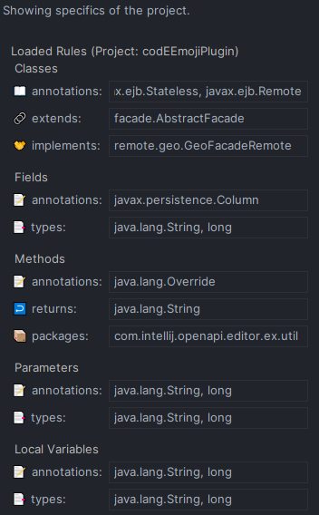

<!-- DESCRIPTION HEADER BEGIN -->

**codeEEmoji** is a plugin made for Intellij Idea and useful for Java programming. The plugin defines new sets of inlay
hints in the context of code
augmentation. The new inlay hints use emojis in an innovative way to help the developer. Emojis are displayed for
anti-pattern cases such as naming
violations or bad programming practices. The plugin can also show emojis in the editor indicating the presence of
modifiers for classes, fields,
methods, parameters or local variables that are being used. Likewise, the developer can indicate emojis to display for
all these elements, according
to a rule, for example, for a class being instantiated that implements a specific interface, for a method being invoked
that is annotated by a certain
annotation , a local variable of a given type, and so on. For the next version, in addition to emojis, the plugin will
be able to show implicit
annotations for JakartaEE and Spring frameworks.

<!-- DESCRIPTION HEADER END -->

<!-- TOC -->

* [Setup and Use](#setup-and-use)
    * [Prerequisites](#prerequisites)
    * [How to Install](#how-to-install)
        * [Via marketplace](#via-marketplace)
        * [Manual Installation](#manual-installation)
    * [How to Configure](#how-to-configure)
* [Cases of Naming Violation](#cases-of-naming-violation)
    * [Short Descriptive Name](#short-descriptive-name)
    * [Getter More Than Accessor](#getter-more-than-accessor)
    * [_Is_ Returns More Than a Boolean](#is-returns-more-than-a-boolean)
    * [Setter Method Returns](#setter-method-returns)
    * [Expecting But Not Getting a Single Instance](#expecting-but-not-getting-a-single-instance)
    * [Validation Method Does Not Confirm](#validation-method-does-not-confirm)
    * [Getter Does Not Return](#getter-does-not-return)
    * [Not Answered Question](#not-answered-question)
    * [Transform Method Does Not Return](#transform-method-does-not-return)
    * [Expecting But Not Getting a Collection](#expecting-but-not-getting-a-collection)
    * [Says One But Contains Many](#says-one-but-contains-many)
    * [Name Suggests Boolean By Type Does Not](#name-suggests-boolean-by-type-does-not)
    * [Says Many But Contains One](#says-many-but-contains-one)
    * [Name Contains Only Special Characters](#name-contains-only-special-characters)
* [Cases of Showing Modifiers](#cases-of-showing-modifiers)
* [Cases of Showing Specifics of Projects](#cases-of-showing-specifics-of-projects)
* [Cases of Showing Implicit Annotations](#cases-of-showing-implicit-annotations)
* [External Service API](#external-service-api)
* [How to Extend](#how-to-extend)
* [Acknowledgements](#acknowledgements)
* [References](#references)

<!-- TOC -->

# Setup and Use

## Prerequisites

- [**IntelliJ IDEA 2023.***](https://www.jetbrains.com/idea/download/other.html) (Ultimate, Community or Educational)
- JDK 17 [(*Eclipse Temurin - as a suggestion*)](https://github.com/adoptium/temurin17-binaries/releases)

## How to Install

### Via marketplace

[JetBrains Marketplace - codEEmoji](https://plugins.jetbrains.com/plugin/22416-cod-emoji)

### Manual Installation

- Download the latest release zip file available
  from [Releases](https://github.com/codeemoji/codeemoji-plugin/releases).

- Open Intellij IDEA and navigate to **_"File>Settings>Plugins"_** menu. Click on the gear icon and the "*
  *_Install Plugin From Disk..._**" option.
  Select the downloaded zip file and click "**_OK_**".

- Restart IDE.

## How to Configure

The plugin creates new Inlay hints. All new inlay hints are enabled by default when installing the plugin. To disable
inlay hints or configure
options that are available for each one, go to "**_File>Settings>Editor>Inlay Hints_**". Click "**_Other>Java_**".

# Cases of Naming Violation

## Short Descriptive Name

Instead of a descriptive name, the variable's name consists of a few letters.

**Configuration options:** Number of letters

_**Impacted identifiers: Fields, Method Parameters and Local Variables**_

## Getter More Than Accessor

A getter that doesn't just return the corresponding attribute but also takes other actions. Adapted from Arnaoudova et
al.(2016).

_**Impacted identifiers: Method Names**_

## _Is_ Returns More Than a Boolean

A method's name is a predicate that denotes a true/false value that will be returned. The return type, however, is a
more complex type than boolean.
Adapted from Arnaoudova et al.(2016).

_**Impacted identifiers: Method Names**_

## Setter Method Returns

A setter method that has a return type other than void. Adapted from Arnaoudova et al.(2016).

_**Impacted identifiers: Method Names**_

## Expecting But Not Getting a Single Instance

Despite the fact that a method's name suggests it will return a single object, it will actually return a collection.
Adapted from Arnaoudova et al.(
2016).

_**Impacted identifiers: Method Names**_

## Validation Method Does Not Confirm

A validation method (such as one with the words <em>validate,</em> <em>check,</em> or <em>ensure</em>) does not confirm
the validation; that is, it
neither provides a return value indicating whether the validation was successful. Adapted from Arnaoudova et al.(2016).

_**Impacted identifiers: Method Names**_

## Getter Does Not Return

When a method's name begins with <em>get</em> or <em>return</em>, for example, it might be assumed that it returns
something, but the return type is
actually void. Adapted from Arnaoudova et al.(2016).

_**Impacted identifiers: Method Names**_

## Not Answered Question

A method's name takes the form of a predicate, but its return type is not boolean. Adapted from Arnaoudova et al.(2016).

_**Impacted identifiers: Method Names**_

## Transform Method Does Not Return

While there is no return value, a method's name implies that an object has been transformed. Adapted from Arnaoudova et
al.(2016).

_**Impacted identifiers: Method Names**_

## Expecting But Not Getting a Collection

Even though a method's name suggests a collection should be returned, nothing or just one object is instead given.
Adapted from Arnaoudova et al.(
2016).

_**Impacted identifiers: Method Names**_

## Says One But Contains Many

An attribute's type suggests that it stores a collection of objects, contrary to the name, which suggests a single
instance. Adapted from Peruma et
al.(2021).

_**Impacted identifiers: Fields, Method Parameters and Local Variables**_

## Name Suggests Boolean By Type Does Not

An attribute's name implies that its value is true or false, yet its defining type is not boolean. Adapted from
Arnaoudova et al.(2016).

_**Impacted identifiers: Fields, Method Parameters and Local Variables**_

## Says Many But Contains One

The name of an attribute suggests multiple instances, but its type suggests a single one. Adapted from Arnaoudova et
al.(2016).

_**Impacted identifiers: Fields, Method Parameters and Local Variables**_

## Name Contains Only Special Characters

The identifier's name is made up entirely of non-alphanumeric characters. Adapted from Arnaoudova et al.(2016).

_**Impacted identifiers: Fields, Method Parameters and Local Variables**_

# Cases of Showing Modifiers

This inlay hint allows you to configure the display of emojis for class, field and method modifiers. Emojis are
displayed when an element is used in the code, indicating its modifiers. The figure below shows the configuration screen
with the options enabled during installation. Then a code snippet is displayed, where all options have been enabled.

_**Impacted identifiers: Classes, Fields and Methods**_

# Cases of Showing Specifics of Projects

This inlay hint is displayed according to the specifics of the project. It must be configured by the developer from a
file in the root of the
project named *"codeemoji.json"*. It allows indicating rules for displaying emojis according to specific features for
each element, as follows:

- Element: Class
    - Features: Annotations, Extends and Implements
- Element: Field
    - Features: Annotations, Types
- Element: Method
    - Features: Annotations, Returns
- Element: Parameter
    - Features: Annotations, Types
- Element: Local Variable
    - Features: Annotations, Types

For each element, it is possible to optionally indicate an emoji from
the [unicode sequence](https://unicode.org/Public/emoji/15.0/emoji-sequences.txt) that represents it. The *"
codeemoji.json"* file follows
a simple description pattern, as shown in the following a partial example:

Complete example [here](docs/samples/codeemoji.json).

In the configuration screen of this inlay hint, the rules currently defined for the open project are displayed. See the
following figure.

Here's an example of usage from a code snipped:

# Cases of Showing Implicit Annotations

Unlike other cases, this inlay hint is useful for displaying implicit annotations when frameworks are used. It can be
displayed for an entirely implicit annotation, for implicit annotation parameters, or even for implicit values for
annotation parameters.

Implicit information is understood to be information that is optional, but with a different standard value. For example,
a class mapped with _@Entity_ will have _@Column_ implicit for almost all fields (restrictions apply), where the _name_
parameter of the
annotation will have the name of the field as its value.

So far the plugin implements some _JPA_ mapping annotations (_Java Persistence API_ - _javax_ and _jakarta_ packages),
and some useful _Spring_ framework annotations.

In the configuration screen of this inlay hint, the annotations currently implemented by plugin are displayed.
See the following figure.

Here's an example of usage with _JPA_ from a code snipped:

Here's an examples of usage with _Spring_ from a code snipped:

# External Services API

The **codeEEmoji** plugin is prepared to work with information provided from external services. It provides extension
points
for creating background services that can obtain information about a source code element for which the insertion of an
inlay hint is being evaluated.

This API is experimental and the plugin currently does not contain any concrete services that use it. However, for
future work it may be useful for cases of inlay hints that involve external services such as code versioners, quality
analyzers, artificial intelligence tools for code prediction, among others.

**codeEEmoji** is already prepared to enable or disable these services, as they can reduce the performance of the IDE,
as
they are transversal to the framework. Therefore, it is up to the user to use these services or not. Services can be
configured using the plugin's global settings. See Figure below.

# How to Extend

**codEEmoji** plugin is licensed under the [GPL v3.0](https://github.com/codeemoji/codeemoji-plugin/blob/main/LICENSE)
license. It is fully developed based
on [IntelliJ Platform Plugin SDK](https://plugins.jetbrains.com/docs/intellij/welcome.html). If you are not familiar
with how to develop plugins for the _IntelliJ IDEA_ IDE,
visit the [site](https://plugins.jetbrains.com/docs/intellij/welcome.html) to learn the basics. A suitable starting
point for those with more experience is the part
about [Inlay hints](https://plugins.jetbrains.com/docs/intellij/inlay-hints.html). It is important to mention that the
_Inlay hints_ feature is a recent feature for _IDE IntelliJ IDEA_ and the **codEEmoji** plugin was developed using a
large
number of API's marked as _@Experimental_. This API's may change in the future and cause compatibility issues. However,
in its current state, the plugin is fully compatible with versions 2023.1.x and 2023.2.x,
using [JDK 17](https://github.com/adoptium/temurin17-binaries/releases/tag/jdk-17.0.8.1%2B1) or higher.

As mentioned in the reference page for
implementing [Inlay hints in the IDE](https://plugins.jetbrains.com/docs/intellij/inlay-hints.html), _"Inlay hints
render small pieces
of
information directly into the editor and give developers additional code insight without disturbing the workflow. A
well-known example is parameter hints that usually display the name of the function parameters as given in its
declaration"_. Inlay hints can be of the type inline (inlays displayed in the code between code tokens) or block (inlays
displayed above a code block) and must be implemented by a provider class that is registered in
the [plugin configuration
file](https://plugins.jetbrains.com/docs/intellij/plugin-configuration-file.html). All cases implemented in the *
*codEEmoji** plugin are Inlay hints that extend or implement the
interface [
_InlayHintsProvider_](https://github.com/JetBrains/intellij-community/blob/idea/232.9921.47/platform/lang-api/src/com/intellij/codeInsight/hints/InlayHintsProvider.kt).

# Acknowledgements

This work was supported by the **Free University of Bozen-Bolzano - UNIBZ**.

# References

Arnaoudova, Venera, Massimiliano Di Penta, and Giuliano Antoniol. "Linguistic antipatterns: What they are and how
mainers perceive them."
_Empirical Software Engineering_ 21 (2016): 104-158.

